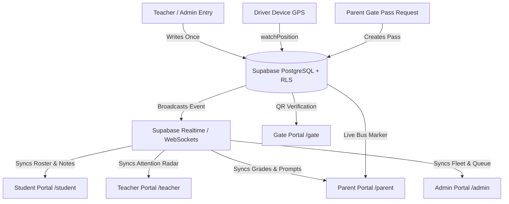

# 🎓 ShikshaSetu (शिक्षासेतु) — AI-Native Unified School Ecosystem

> **"One Canonical Truth — 6 Specialized Experiences"**
> An AI-native, multi-tenant Indian school management & learning acceleration platform that connects Students, Teachers, Parents, School Administrators, Bus Drivers, and Campus Security in real-time.

---

## 🌟 Executive Overview

Traditional School ERPs are fragmented dashboards containing separate datasets, stale attendance, and disconnected messaging. **ShikshaSetu** solves this with a single foundational principle:

$$\text{Data Entered Once} \longrightarrow \text{Canonical Database (PostgreSQL + RLS)} \longrightarrow \text{Synchronized Cross-Portal Experiences}$$

When a teacher logs marks or takes attendance, the update reflects synchronously across the **Student Command Center**, the **Parent Companion**, and the **Admin Operations Console** without data duplication or simulated metrics.

---

## 🚀 The 6 Unified Portals

### 1. 🎓 Student Learning Command Center (`/student`)
*Empowering Indian students to answer: **"What do I need to do today, and what should I study next?"***
- **Daily Action Priorities**: Categorized into 🔴 *Due Today*, 🟠 *Test Tomorrow*, and 🔵 *5-Minute Practice*.
- **"What Should I Study Next?"**: AI-guided study recommendation grounded in verified diagnostic gaps (e.g., Equivalent Fractions).
- **AI Revision Notes & Diagnostic Loop**:
  - NCERT-aligned concept breakdowns with real-life analogies and interactive concept chips.
  - **"Quiz Me" 3-Question Diagnostic**: Real-time answer evaluation with mastery level feedback and actionable next steps.
  - Personal Revision Notes library with instant search.
- **Indian Exam Preparation Hub**: Syllabus checklists, countdown timers, and revision status trackers.
- **SchoolMitra AI Tutor**: Context-grounded conversational homework helper with safety filters.
- **Worry Jar**: Private student emotional check-in with sentiment screening for counselor intervention.

---

### 2. 👨‍🏫 Teacher Workspace (`/teacher`)
*Solving the daily operational problem: **"Who needs my attention today, and what should I do?"***
- **3-Student Dominant Attention Radar**: Instantly highlights students with learning gaps (e.g., Priya Patel $58\%$), pending submissions, or low attendance.
- **Daily Teaching Schedule**: Compact timeline showing periods, classrooms, and syllabus objectives.
- **Rapid Attendance Taker**: One-tap Present/Absent/Late roll calls with offline batch queue support.
- **Homework Review Hub**: Bulk submission inspection with one-click AI grading insights.
- **Academic Marks Panel**: Normalized exam/test grading with instant canonical data sync.
- **Automated Report Card Generation**: Client & server-side non-blank printable PDF report cards with CBSE grading scales.
- **Class Climate & Audio Quick Logging**: Voice-to-text observation logging and class sentiment monitoring.

---

### 3. 🏡 Parent Companion (`/parent`)
*Answering the primary family question: **"How is my child doing, and how can I help?"***
- **Academic Health Snapshot**: Clean 3-subject cards (Math $58\%$ Needs Attention, Science $82\%$ On Track, English $76\%$ On Track).
- **"How You Can Help Tonight" (5-Minute Dinner Prompts)**: Translates school data into practical everyday dinner questions (e.g., *"Can you explain why 2/4 of a pizza is the same as 1/2?"*).
- **🔴 Urgent Reminders**: Highlights upcoming Friday tests and pending worksheets with direct links.
- **🚌 Real-Time Live Bus Tracking**: High-accuracy Leaflet OpenStreetMap live marker subscribing to the driver's real GPS broadcast.
- **🎫 Digital Gate Pass System**: Instant early pickup request submission with dynamic QR verification.
- **💬 Teacher Direct Messaging**: Synchronous conversation thread with the student's assigned class teacher.

---

### 4. 🏛️ Admin Mission Control (`/admin`)
*Centralized operational hub answering: **"What needs to be managed today?"***
- **School Operations Snapshot**: Real-time metrics for 428 students, 32 faculty members (100% present), and 401 daily attendees.
- **"Needs Attention Today" Operational Queue**:
  - 12 attendance concerns ($<80\%$).
  - 8 pending academic reviews.
  - 4 parent gate pass / PTM requests awaiting approval.
  - 3 overdue fee notices.
- **Canonical School Registry**: Full Master CRUD for Students, Parents, Teachers, and Classes with UUID mapping.
- **Transport Management**: Route planning, vehicle tracking, and driver assignments.
- **School Announcements**: Multi-channel broadcasting for school circulars, holidays, and exam schedules.

---

### 5. 🚌 Driver Telemetry Console (`/driver`)
*Single-purpose mobile operational tool: **"Start Trip → Drive → Stop Trip"***
- **Zero Distractions**: High-contrast dark mode with massive action buttons and minimal text.
- **Real Device GPS Acquisition**: Uses browser `navigator.geolocation.watchPosition` with `{ enableHighAccuracy: true }`.
- **Live Freshness Counter**: Displays seconds elapsed since the last verified server broadcast (`"Updated 4s ago"`).
- **5-State Engine**: `GPS READY` $\rightarrow$ `LOCATION ACTIVE` $\rightarrow$ `LOCATION UNAVAILABLE` $\rightarrow$ `NETWORK ERROR` $\rightarrow$ `TRIP ENDED`.

---

### 6. 🛡️ Gate Security & Dismissal Portal (`/gate`)
*High-throughput campus access & dismissal safety console.*
- **Camera QR Scanner**: High-speed QR scanning for parent gate passes with instant identity verification.
- **Manual Pass Code Fallback**: 6-digit numeric override for parents without smartphones.
- **Real-Time Dismissal Log**: Synchronous WebSocket broadcast when a student is cleared at the gate.

---

## 🏗️ Architectural Overview & Data Flow



---

## 🛠️ Technology Stack

| Layer | Technologies |
|---|---|
| **Frontend Framework** | [Next.js 14](https://nextjs.org/) (App Router, React 18, TypeScript) |
| **Styling & Motion** | Tailwind CSS, CSS Custom Properties, Framer Motion |
| **Mapping & Telemetry** | Leaflet.js, OpenStreetMap, HTML5 Geolocation API |
| **Database & Security** | [Supabase](https://supabase.com/) (PostgreSQL with Row Level Security & Multi-Tenancy) |
| **Authentication** | [Clerk Auth](https://clerk.com/) with Idempotent Database Onboarding Linking |
| **Realtime Sync** | Supabase Realtime (Postgres Changes) + Socket.io |
| **Testing Suite** | Vitest (250+ Unit & Integration Tests), Playwright (E2E) |
| **Monitoring & Quality** | Sentry SDK, React Error Boundaries |

---

## 📁 Repository Structure

```
├── app/                        # Next.js App Router Pages & Actions
│   ├── actions/                # Server Actions (Bus, Data, Gate Pass, Wellness, AI)
│   ├── admin/                  # Admin Mission Control Portal
│   ├── api/                    # REST Endpoints (Demo, Cron, Notifications, Scans)
│   ├── driver/                 # Driver Telemetry Console
│   ├── gate/                   # Gate Safety & Dismissal Portal
│   ├── parent/                 # Parent Companion Portal
│   ├── student/                # Student Learning Command Center
│   └── teacher/                # Teacher Workspace Portal
├── components/                 # Reusable Domain & UI Components
│   ├── admin/                  # Admin Dashboard, Registry CRUD, Analytics
│   ├── copilot/                # Administrative & Teacher AI Copilot Strips
│   ├── driver/                 # Driver Portal Client
│   ├── gate/                   # Gate Portal Client & QR Scanner
│   ├── mindmap/                # D3 Concept Knowledge Graph Canvas
│   ├── onboarding/             # Role Onboarding & Story Experience
│   ├── parent/                 # Parent Home, Homework, Bus Tracking, AI Drawer
│   ├── schoolgpt/              # SchoolGPT Context Engine & Voice Modals
│   ├── shared/                 # Toast, Modal, Skeletons, Transit Map, Language Toggle
│   ├── student/                # Today Tasks, AI Revision Notes, Timetable, Worry Jar
│   └── teacher/                # Teacher Workspace, Attendance, Marks, PDF Generator
├── lib/                        # Core Utilities, Domain Engines & Supabase Clients
│   ├── ai-narration/           # AI Parent/Teacher summary generators
│   ├── auth/                   # Clerk context resolution & role guards
│   ├── canonical/              # Canonical ID definitions & schema contracts
│   ├── rules-engine/           # Student health & alert calculation engines
│   └── supabase/               # Admin & User server/client Supabase factories
├── supabase/                   # Supabase Database Migrations & Seed Data
│   ├── migrations/             # 38 Modular SQL migrations (Multi-tenancy, RLS, Coins)
│   └── seed.sql                # Deterministic canonical seed dataset (Aarav, Sunita, Rajesh)
└── tests/                      # Automated Vitest & Playwright Test Suites
    ├── ai/                     # Grounding & role consistency tests
    ├── ecosystem/              # Cross-portal canonical consistency tests
    ├── student/                # Student portal priority & test prep tests
    ├── teacher/                # Teacher portal radar & report card tests
    └── transport/              # Realtime GPS bus tracking tests
```

---

## 💻 Local Development Setup

### 1. Clone the Repository
```bash
git clone https://github.com/ankit4563564/ShikshaSetu.git
cd ShikshaSetu
```

### 2. Install Dependencies
```bash
npm install
```

### 3. Environment Variables Configuration
Create a `.env.local` file in the root directory:
```env
# Next.js
NEXT_PUBLIC_APP_URL=http://localhost:3000

# Supabase
NEXT_PUBLIC_SUPABASE_URL=your_supabase_url
NEXT_PUBLIC_SUPABASE_ANON_KEY=your_supabase_anon_key
SUPABASE_SERVICE_ROLE_KEY=your_supabase_service_role_key

# Clerk Authentication
NEXT_PUBLIC_CLERK_PUBLISHABLE_KEY=your_clerk_publishable_key
CLERK_SECRET_KEY=your_clerk_secret_key
```

### 4. Run Development Server
```bash
npm run dev
```
Open [http://localhost:3000](http://localhost:3000) in your browser.

---

## 🧪 Testing & Verification

ShikshaSetu includes a 250-test automated verification suite:

```bash
# Run all unit and integration tests
npx vitest run --testTimeout=15000

# Run specific domain test suites
npx vitest run tests/ecosystem/aaravIdentityConsistency.test.ts
npx vitest run tests/student/studentPortal.test.ts
npx vitest run tests/teacher/teacherPortal.test.ts
npx vitest run tests/transport/liveBusTracking.test.ts

# Run production build validation
npm run build
```

---

## 🔒 Security & Multi-Tenancy

- **Row Level Security (RLS)**: Strict database-level policies ensure parents only access their linked children, teachers only view assigned classes, and tenant data remains isolated by `school_id`.
- **Idempotent Clerk Onboarding**: Automatic user reconciliation maps authenticated emails to canonical database records on first login.
- **Zero Mock Telemetry**: Hardware GPS queries and safety gate passes are validated on the server before database writes.

---

## 📜 License

This project is licensed under the [MIT License](LICENSE).
