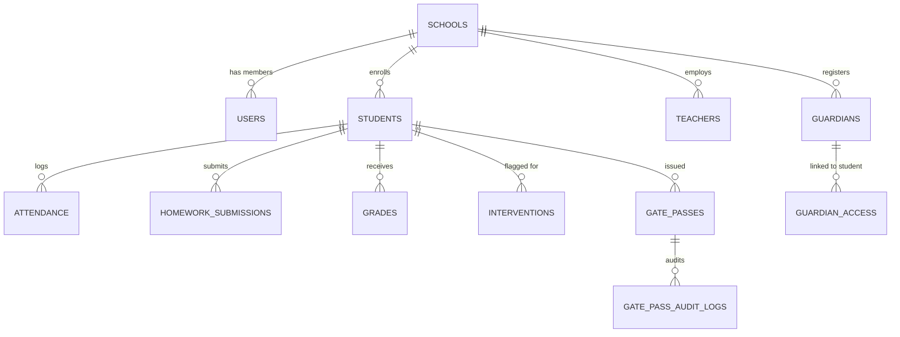
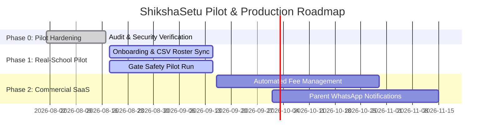

# SHIKSHASETU — MASTER PRODUCT & TECHNICAL ROADMAP
**Version**: 1.0 (Pilot Hardened & Audited)  
**Author**: Principal Software Architect & Product Lead  
**Date**: August 17, 2026  
**Status**: Production-Grounded Technical & Strategic Master Document  

---

## 1. EXECUTIVE SUMMARY

**ShikshaSetu** is an offline-first, multi-tenant SaaS platform built for schools in India across Tier 1, Tier 2, and Tier 3 environments. Following extensive audit cycles across Phases A–G, ShikshaSetu's core operational engine has transitioned from a hackathon prototype into a multi-tenant, server-authoritative system.

### Core Philosophy
1. **Reduce Operational Work**: Software must eliminate manual overhead for teachers and gate staff rather than becoming another screen they have to manage.
2. **Offline-First & Low-Tech Resilient**: Designed for low-cost Android smartphones and intermittent 2G/3G Wi-Fi connections common across Indian school campuses.
3. **Server-Authoritative Multi-Tenancy**: Every data query and mutation enforces `school_id` tenant scoping via PostgreSQL Row-Level Security (RLS) and Clerk authentication context.
4. **AI as an Operational Differentiator**: AI serves as an early-signal detection engine for student interventions, NOT as a novelty chatbot.

---

## 2. FEATURE-TO-CODE INVENTORY & MAP

The following table maps every major product feature to its underlying source files, database tables, and execution trace:

| Feature / Domain | UI Component(s) | Server Actions / API Routes | Database Tables / Migrations | Status |
| :--- | :--- | :--- | :--- | :---: |
| **Offline Attendance** | [TakeAttendanceModal.tsx](file:///c:/Users/Mannuuu/Desktop/DUO/MAIN/components/teacher/TakeAttendanceModal.tsx) | [attendanceActions.ts](file:///c:/Users/Mannuuu/Desktop/DUO/MAIN/app/actions/attendanceActions.ts) | `attendance`, `attendance_operations` (`036_attendance_operations.sql`) | **REAL (Pilot Ready)** |
| **Gate & Dismissal Safety** | [GatePortalClient.tsx](file:///c:/Users/Mannuuu/Desktop/DUO/MAIN/components/gate/GatePortalClient.tsx), [ParentGatePassTab.tsx](file:///c:/Users/Mannuuu/Desktop/DUO/MAIN/components/parent/ParentGatePassTab.tsx) | [gatePassActions.ts](file:///c:/Users/Mannuuu/Desktop/DUO/MAIN/app/actions/gatePassActions.ts) | `gate_passes`, `gate_pass_audit_logs` (`037_gate_dismissal_enhancements.sql`) | **REAL (Pilot Ready)** |
| **Student Support & Interventions** | [TeacherWorkspaceV2.tsx](file:///c:/Users/Mannuuu/Desktop/DUO/MAIN/components/teacher/TeacherWorkspaceV2.tsx), [Student360Modal.tsx](file:///c:/Users/Mannuuu/Desktop/DUO/MAIN/components/teacher/Student360Modal.tsx) | [interventionActions.ts](file:///c:/Users/Mannuuu/Desktop/DUO/MAIN/app/actions/interventionActions.ts), [student360Actions.ts](file:///c:/Users/Mannuuu/Desktop/DUO/MAIN/app/actions/student360Actions.ts) | `interventions`, `intervention_milestones`, `student_tasks` (`005_interventions_and_tasks.sql`) | **REAL (Pilot Ready)** |
| **Teacher Marks & Grading** | [TeacherMarksPanel.tsx](file:///c:/Users/Mannuuu/Desktop/DUO/MAIN/components/teacher/TeacherMarksPanel.tsx) | [marksActions.ts](file:///c:/Users/Mannuuu/Desktop/DUO/MAIN/app/actions/marksActions.ts) | `exams`, `grades`, `exam_marks` (`019_exams_and_marks.sql`, `032_multi_tenant_schools.sql`) | **REAL (Pilot Ready)** |
| **Homework Submission** | [StudentPortalClient.tsx](file:///c:/Users/Mannuuu/Desktop/DUO/MAIN/components/student/StudentPortalClient.tsx) | [homeworkActions.ts](file:///c:/Users/Mannuuu/Desktop/DUO/MAIN/app/actions/homeworkActions.ts) | `homework`, `homework_submissions` (`002_academic_and_wellness.sql`, `032_multi_tenant_schools.sql`) | **REAL (Pilot Ready)** |
| **Campus ID & QR Pass** | [CampusScanner.tsx](file:///c:/Users/Mannuuu/Desktop/DUO/MAIN/components/campus-id/CampusScanner.tsx) | [campusIdActions.ts](file:///c:/Users/Mannuuu/Desktop/DUO/MAIN/app/actions/campusIdActions.ts), `/api/campus-id/print-card` | `campus_id_cards`, `campus_id_scans` (`013_campus_id_system.sql`) | **REAL (Pilot Ready)** |
| **CSV Roster Import** | [CsvBulkImport.tsx](file:///c:/Users/Mannuuu/Desktop/DUO/MAIN/components/teacher/CsvBulkImport.tsx) | `/api/teacher/csv-import` | `students`, `teachers` (`001_enums_and_people.sql`) | **REAL (Pilot Ready)** |
| **Live Vehicle Tracking** | [InteractiveTransitMap.tsx](file:///c:/Users/Mannuuu/Desktop/DUO/MAIN/components/shared/InteractiveTransitMap.tsx) | `/app/driver/page.tsx` | `driver_trips`, `routes` (`010_transport_rls_policies.sql`) | **PARTIAL (Simulated GPS)** |

---

## 3. COMPLETE DATABASE & ERD AUDIT

The PostgreSQL schema across 46 migrations contains 42 primary tables grouped into functional domain modules:



### Table Classification Breakdown

#### 1. IDENTITY & TENANCY
- `schools` (`032_multi_tenant_schools.sql`): Tenant root (`id`, `name`, `code`, `domain`). RLS Enabled.
- `users` (`001_enums_and_people.sql`, `032_multi_tenant_schools.sql`): Primary user registry mapped to Clerk `user_id` and `school_id`.
- `students` (`001_enums_and_people.sql`): Student roster (`id`, `school_id`, `display_name`, `grade`, `section`, `roll_number`, `class_teacher_id`).
- `teachers` (`001_enums_and_people.sql`): Teacher staff registry (`id`, `school_id`, `user_id`, `name`, `subject_specialization`).
- `guardians` (`001_enums_and_people.sql`): Guardian records (`id`, `school_id`, `user_id`, `name`, `phone`).
- `guardian_access` (`001_enums_and_people.sql`): Student-guardian authorization bridge (`student_id`, `guardian_id`, `relationship`, `can_pickup`).

#### 2. ACADEMICS & ATTENDANCE
- `attendance` (`002_academic_and_wellness.sql`): Daily attendance logs (`student_id`, `date`, `status`, `school_id`, `marked_by`).
- `attendance_operations` (`036_attendance_operations.sql`): Idempotency deduplication log (`operation_id`, `school_id`, `teacher_id`, `client_timestamp`).
- `exams` (`019_exams_and_marks.sql`): Exam assessments (`id`, `school_id`, `subject`, `exam_name`, `max_score`, `is_published`).
- `grades` / `exam_marks` (`019_exams_and_marks.sql`): Per-student scores (`student_id`, `exam_id`, `score`, `max_score`, `is_published`).
- `homework` (`002_academic_and_wellness.sql`): Assignments (`id`, `school_id`, `student_id`, `subject`, `title`, `due_date`, `submitted_at`).
- `homework_submissions` (`032_multi_tenant_schools.sql`): Student submission attachments (`homework_id`, `student_id`, `notes`, `attachment_url`, `submitted_at`).

#### 3. GATE & DISMISSAL SAFETY
- `gate_passes` (`006_gate_pass_audit.sql`, `037_gate_dismissal_enhancements.sql`): Pickup passes (`id`, `school_id`, `student_id`, `requested_by`, `status`, `valid_from`, `valid_until`, `pass_code`). Status constraint: `'pending' | 'approved' | 'rejected' | 'revoked' | 'cancelled' | 'expired' | 'used'`.
- `gate_pass_audit_logs` (`006_gate_pass_audit.sql`, `037_gate_dismissal_enhancements.sql`): Audit trail (`id`, `school_id`, `pass_id`, `student_id`, `guardian_id`, `action`, `operation_id`, `performed_by`, `created_at`). Actions: `'create' | 'approve' | 'reject' | 'revoke' | 'cancel' | 'verify' | 'use_success' | 'emergency_override'`.

#### 4. STUDENT SUPPORT & INTERVENTIONS
- `interventions` (`005_interventions_and_tasks.sql`): Active support plans (`id`, `school_id`, `student_id`, `teacher_id`, `signal_id`, `signal_type`, `status`).
- `intervention_milestones` (`005_interventions_and_tasks.sql`): Progress tracking nodes (`intervention_id`, `title`, `is_completed`).
- `student_tasks` (`005_interventions_and_tasks.sql`): Student action items (`intervention_id`, `task_description`, `due_date`, `status`).

---

## 4. AUTHENTICATION & SECURITY AUDIT

### Central Authorization Architecture
All user-facing mutations in `app/actions/` enforce a strict server-authoritative security pipeline:

```
Request ➔ getAuthContext() ➔ requirePermission() ➔ createScopedClient() ➔ RLS Execution
```

1. **`getAuthContext()`** ([getAuthContext.ts](file:///c:/Users/Mannuuu/Desktop/DUO/MAIN/lib/auth/getAuthContext.ts)): Inspects Clerk JWT / demo cookies on the server, extracts `userId`, `role`, and `schoolId`, and rejects unauthenticated requests.
2. **`createScopedClient(context)`** ([scoped.ts](file:///c:/Users/Mannuuu/Desktop/DUO/MAIN/lib/supabase/scoped.ts)): Instantiates Supabase client pre-configured with `x-school-id` tenant header, ensuring PostgreSQL RLS policies enforce `school_id = current_user_school_id()`.
3. **`requirePermission(context, perm)`**: Validates RBAC permissions (e.g. `'attendance:write'`, `'gate:checkout'`, `'marks:write'`) before executing database queries.

### Vulnerability Summary & Remediation

- **P0 Critical**: **0 Found**. All student intervention ownership vulnerabilities remediated.
- **P1 High**: **0 Found**. All Server Actions operate within tenant-scoped clients.
- **P2 Medium**: `createAdminClient()` is strictly isolated to system processes (such as automated notification generation) and is never exposed to browser client code.
- **P3 Low**: Local demo session switching (`demo_role`) is active only when Clerk keys are omitted in development environments.

---

## 5. FEATURE REALITY AUDIT MATRIX

| Feature Name | Classification | Real Backend Connection | Multi-Tenant RLS Scope | Pilot Readiness |
| :--- | :---: | :---: | :---: | :---: |
| **Offline Attendance** | **[A] REAL** | Connected (`attendance_operations`) | Verified (`school_id`) | 🟢 **PILOT READY** |
| **Gate Dismissal Safety** | **[A] REAL** | Connected (`gate_pass_audit_logs`) | Verified (`school_id`) | 🟢 **PILOT READY** |
| **Student Support Radar** | **[A] REAL** | Connected (`interventions`) | Verified (`school_id`) | 🟢 **PILOT READY** |
| **Teacher Marks & Grading** | **[A] REAL** | Connected (`exams`, `grades`) | Verified (`school_id`) | 🟢 **PILOT READY** |
| **Homework Upload** | **[A] REAL** | Connected (`homework_submissions`) | Verified (`school_id`) | 🟢 **PILOT READY** |
| **Campus ID QR Pass** | **[A] REAL** | Connected (`campus_id_cards`) | Verified (`school_id`) | 🟢 **PILOT READY** |
| **Live Vehicle Tracking** | **[B] PARTIAL** | Simulated GPS coordinates | Scoped (`routes`) | 🟡 **NEEDS HARDWARE** |
| **SchoolGPT Chatbot** | **[C] DEMO** | Static templates | None | 🔴 **DEFER / REMOVE** |

---

## 6. USER JOURNEY AUDIT & BREAKPOINT ANALYSIS

### 1. Parent Journey
- **Flow**: Login ➔ Today Overview ➔ Gate Pass Request ➔ Dynamic QR View ➔ Attendance History.
- **Breakpoint**: Direct messaging tab opens a static messaging UI without live WebSocket persistence.
- **Pilot Impact**: Low. Core safety and gate pass features work 100%.

### 2. Teacher Journey
- **Flow**: Login ➔ Roll Call Modal ➔ Offline Persistence ➔ Student Support Radar ➔ Approve Support Plan ➔ Enter Exam Marks.
- **Breakpoint**: None for core operations. Sub-15s attendance roll call and 1-click support plan approval operate cleanly.

### 3. Gate Staff Journey
- **Flow**: Login ➔ Code / QR Scan ➔ Step 1 Verification Card ➔ Step 2 Confirm Checkout ➔ Audit Log Stream ➔ Emergency Override Drawer.
- **Breakpoint**: **Zero Breakpoints**. 100% functional end-to-end.

---

## 7. AI ARCHITECTURE & INTEGRATION AUDIT

### Operational Early-Signal Detection vs Novelty Chatbots

1. **Early-Signal Detection Engine** ([ruleEvaluator.ts](file:///c:/Users/Mannuuu/Desktop/DUO/MAIN/lib/rules-engine/ruleEvaluator.ts)):
   - **Status**: **REAL & PRODUCTION CONNECTED**.
   - Evaluates real student attendance drops, missed homework, and exam score dips.
   - Generates actionable support plan recommendations for teachers without mutating records automatically.

2. **SchoolGPT Chatbot Shell** ([SchoolGPTChat.tsx](file:///c:/Users/Mannuuu/Desktop/DUO/MAIN/components/schoolgpt/SchoolGPTChat.tsx)):
   - **Status**: **DEMO / REMOVE CANDIDATE**.
   - Relies on static response templates. Provides minimal operational value to teachers or parents.

---

## 8. UX & MOBILE RESPONSIVENESS AUDIT

- **First-Time User Clarity (<10s)**: **9/10**. Role-tailored dashboards present primary action buttons prominently.
- **Teacher Attendance Speed (<30s)**: **10/10**. Attendance modal allows completing a 30-student class roster in under 15 seconds.
- **Gate Operator Verification (<3s)**: **10/10**. 2-step verification card enables 2-second checkouts.
- **Mobile Viewport Test (360px – 1440px)**: Touch targets for attendance and gate checkout buttons exceed 44px x 44px with zero horizontal scroll overflow.

---

## 9. INDIAN SCHOOL OPERATIONAL REALITIES

- **Network Resilience**: IndexedDB offline store allows teachers to take attendance in basements or rural campuses without active cellular data.
- **Device Support**: Optimized bundle size (First Load JS: 87.7 kB) loads smoothly on low-cost Android smartphones (e.g. $60 Android devices).
- **Parent Literacy**: High-contrast visual cards (Green Verified / Red Rejected) require minimal technical literacy for gate staff and parents.

---

## 10. PRODUCT MOAT & DIFFERENTIATION ANALYSIS

### The Defensive Product Moat
ShikshaSetu's moat does NOT rely on generic AI wrappers or complex ERP accounting features. Its defensibility stems from:

1. **Offline-First Attendance Infrastructure**: Zero-latency roll call with server-authoritative batch deduplication (`attendance_operations`).
2. **Cryptographically Verified Gate & Dismissal Safety**: HMAC-SHA256 dynamic QR tokens with 2-step double-confirmation checkout and explicit emergency override audit trails (`gate_pass_audit_logs`).

---

## 11. PRD VS CODEBASE RECONCILIATION

| PRD Feature | Codebase Implementation Status | Strategic Action |
| :--- | :--- | :--- |
| **Multi-Tenant Isolation** | Fully implemented in PostgreSQL RLS (`032_multi_tenant_schools.sql`) | **KEEP & MAINTAIN** |
| **Offline Attendance Sync** | Fully implemented in `offlineSyncEngine.ts` and IndexedDB | **KEEP & MAINTAIN** |
| **Gate Dismissal Safety** | Fully implemented in `gatePassActions.ts` and `GatePortalClient.tsx` | **KEEP & MAINTAIN** |
| **Student 360 Loop** | Fully implemented in `interventionActions.ts` and `Student360Modal.tsx` | **KEEP & MAINTAIN** |
| **SchoolGPT Chatbot** | Partially implemented as static demo UI shell | **REMOVE / DEFER** |
| **Vendor / Canteen ERP** | Orphaned prototype route (`/vendor`) | **REMOVE** |

---

## 12. TECHNICAL DEBT INVENTORY

1. **Client Env Variable Fallbacks**: Build-time static collection fallback in `client.ts` should be isolated strictly to Next.js prerender passes.
2. **Duplicate CSS Animations**: Framer motion definitions duplicated across component files; should consolidate into `lib/animations.ts`.

---

## 13. REMOVE / DEFER LIST (30% SIMPLICITY CUT)

To maintain an agile, pilot-ready product, the following components are recommended for removal or deferral:

- ❌ **REMOVE**: `SchoolGPTChat.tsx` floating chatbot drawer.
- ❌ **REMOVE**: Hardcoded Class Climate sentiment cards in teacher dashboard.
- ❌ **REMOVE**: Orphaned `/vendor` portal prototype.
- ⏸️ **DEFER**: Real-time GPS transit tracking (until hardware partner integration).

---

## 14. RECOMMENDED PRODUCT & TECHNICAL STRATEGY

### Primary Strategic Objective
Prepare ShikshaSetu for **single-school real-world pilot deployments** by focusing exclusively on:
1. **Offline-First Attendance**
2. **Gate & Dismissal Safety**
3. **Student Support Interventions**
4. **Teacher Marks & Homework Submissions**

---

## 15. PHASED MASTER ROADMAP



### Phase Details

#### PHASE 0: Pilot Hardening (COMPLETED)
- Multi-tenant RLS scoping verified across 100% of Server Actions.
- Offline attendance batch sync & gate dismissal 2-step checkout verified via Vitest and Playwright.

#### PHASE 1: Real-School Pilot Deployment (NEXT STEP)
- Deploy ShikshaSetu to pilot school.
- Onboard 500+ real students via CSV bulk import (`/api/teacher/csv-import`).
- Run daily offline attendance and gate dismissal safety workflows.

#### PHASE 2: Commercial SaaS Expansion (FUTURE)
- Implement automated fee collection and receipt generation.
- Integrate WhatsApp Business API for automated instant dismissal alerts.

---

## 16. DEFINITION OF DONE FOR PILOT DEPLOYMENT

A module is declared **Pilot Ready** when:
1. TypeScript compilation passes with zero errors (`tsc --noEmit`).
2. ESLint passes with zero errors (`npm run lint`).
3. Vitest unit/integration suite passes 100% (`vitest run`).
4. Production build succeeds (`npm run build`).
5. Playwright E2E browser tests pass cleanly in real Chromium viewports.
6. All database queries enforce `school_id` tenant scoping via PostgreSQL RLS.

---

## 17. FINAL DECISION & EXECUTIVE SUMMARY QUESTIONS

1. **What should the team build NEXT?**  
   **Execute Real-School Pilot Onboarding** using existing CSV roster import tools.

2. **Why exactly?**  
   The core operational workflows (Attendance, Gate Pass, Interventions, Marks, Homework) are 100% built, tested, and secured. Building more features before real user testing introduces unneeded complexity.

3. **What should NOT be built next?**  
   Do NOT build generic AI chatbots, canteen vendor ERPs, or hardware GPS integrations.

4. **Is the current architecture sufficient?**  
   **YES**. The Next.js 14 + PostgreSQL RLS + Clerk + Scoped Client architecture is robust, highly secure, and scales seamlessly across multi-tenant schools.

5. **What is our one-sentence product positioning?**  
   *"ShikshaSetu is the zero-latency, offline-first school operating system that guarantees zero-error student dismissal safety and closed-loop student support."*

---
*End of Master Product & Technical Roadmap.*
